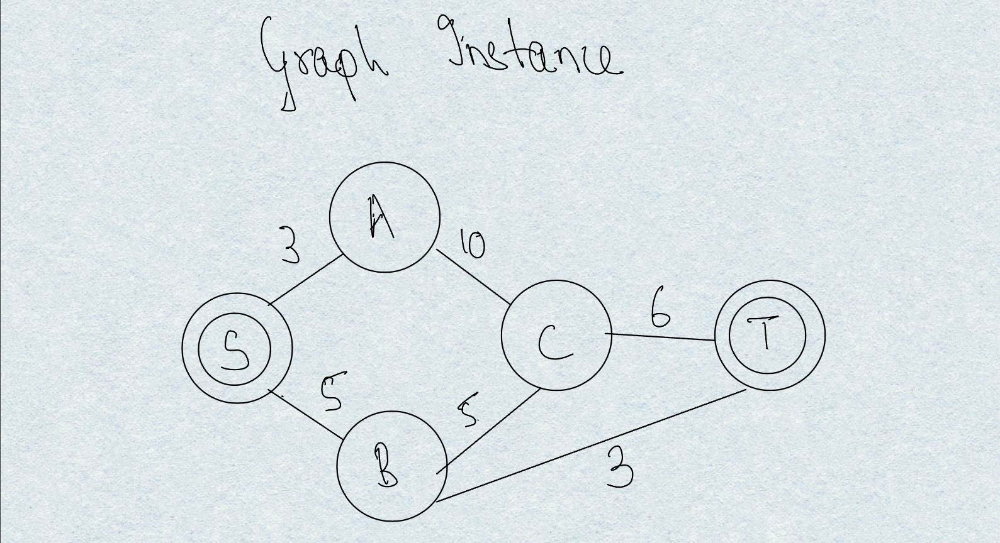
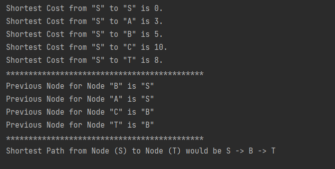

## ROUTENPLANUNG README

### Questions for GUI Team [Last updated 25.06]
- [X] Are the source and target nodes always be going to get labeled as S & T?
- [X] How are the heuristics being set on the GUI, and the user will always underestimate the heuristic values?

---

## Algorithms

---

### Dijkstra Algorithm

#### TODO

- [X] Adding Docs
- [X] Changing the Logs format
- [X] Adding Loggers
- [X] Revise the Logic of exploring nodes 
- [X] Color Scheme the selected path 
- [ ] Create 2 Graphs - For Presentation
- [ ] Presentation Slides

#### Images for Debugging

---

### A* Algorithm
